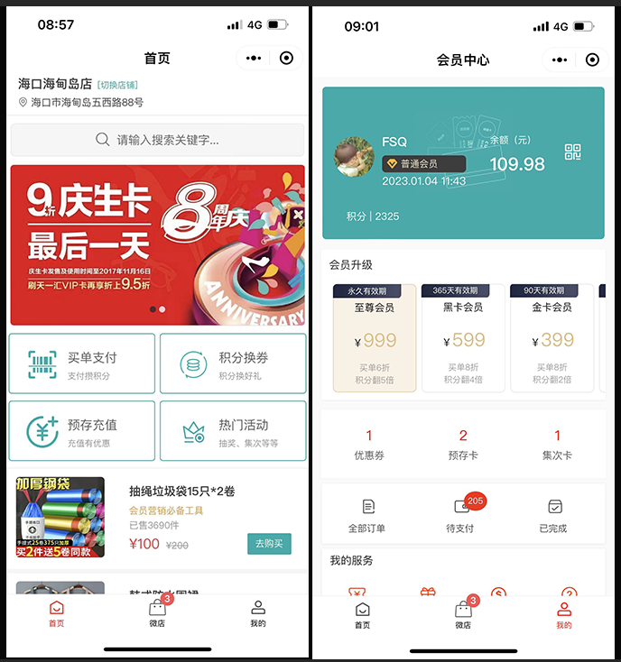
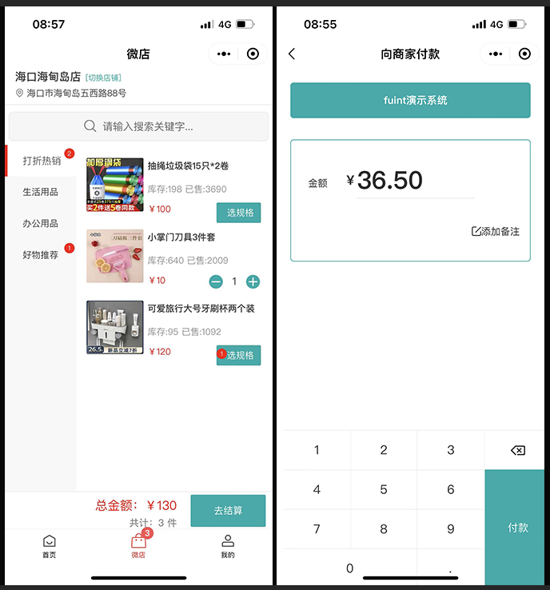
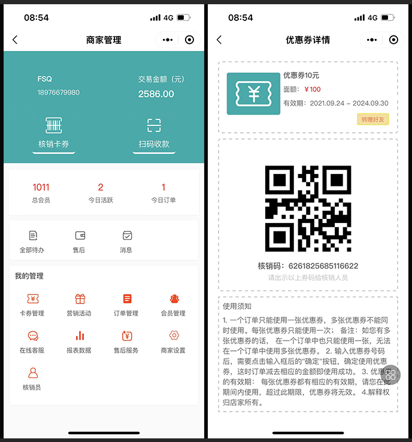
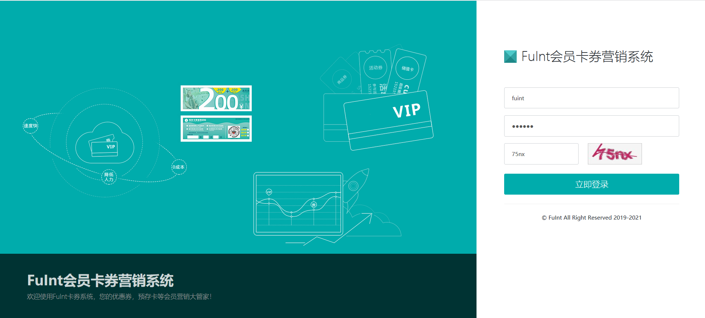
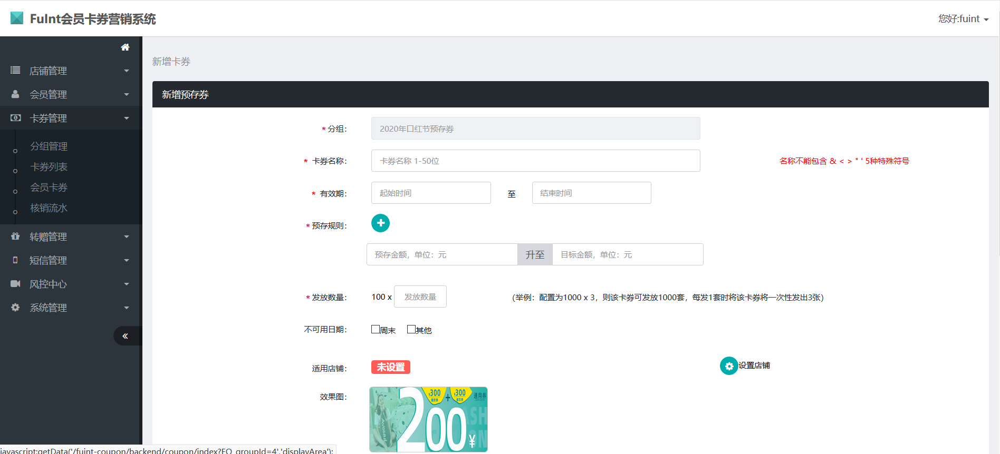
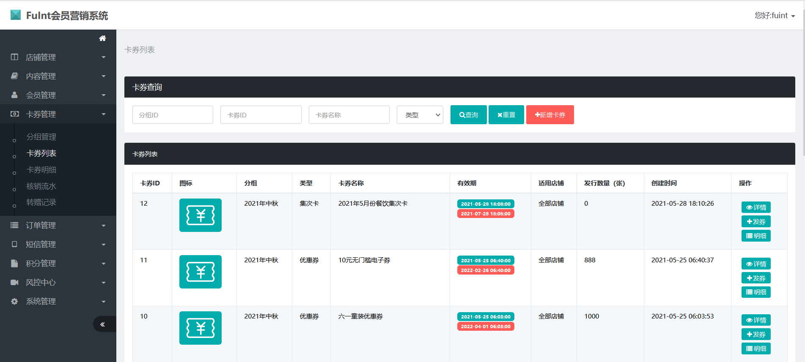

# FuInt会员营销系统介绍

#### 介绍
欢迎使用FuInt会员营销系统。本项目包含优惠券、预存卡、集次卡、短信发送、储值卡、电子券，会员积分体系，支付收款等营销功能，支持批量操作。源码完整，包含前台微信小程序、h5、后端api、后台管理三部分。本系统适用于各类实体店铺，如酒店、汽车4S店、鲜花店、甜品店、餐饮店等，
也适用于线上的电商系统，有独立的接入api，建议咨询下方的微信，以便提供更完善的功能。

以下是前台的页面展示：

Fuint侧重于线下实体店的私域流量的运营，帮助商户降低获客成本。顾客通过扫码支付成为私域流量，支付即可成为会员。积分和卡券功能建立起会员等级体系，通过消息推送和短信营销方便触达用户。

1、会员运营自动化：商家通过日常活动设置，如开卡礼设置，沉睡唤醒等，成为会员后自动给顾客送优惠券，让顾客更有黏性，提升会员运营效率。

2、会员体系完整化：积分、会员等级权益、积分加速、买单折扣。

#### 软件架构
后端：JAVA（springMvc + mybatis） + MYSQL + Redis
前端：采用基于Vue的uni-app，前后端分离，支持微信小程序、支付宝小程、h5等

前端使用技术 
2.1 Vue 
2.3 uniapp

后端使用技术 
1.1 SpringMvc 
1.2 mybatis、MyBatis-Plus 
1.3 SpringSecurity 
1.5 Druid 
1.6 Slf4j 
1.7 Fastjson 
1.8 JWT 
1.9 Redis 
1.10 Quartz 
1.11 Mysql

#### 安装步骤

1.  导入数据库
2.  修改配置文件
3.  将工程打包，然后把war包放入tomcat中

#### 前台使用说明

1.  会员登录，登录成功后可看到会员的卡券列表。
2.  卡券领取和购买，预存券的充值等。
3.  核销卡券，会员在前台出示二维码，管理员用微信扫一扫即可核销。
4.  卡券转赠，会员可将自己的卡券转赠给其他用户，输入对方的手机号即可完成转赠，获赠的好友会收到卡券赠送的短信。

#### 后台使用
1.  会员管理：会员新增、导入、禁用等。
2.  卡券管理：电子券管理为2层结构，即电子券组和电子券。
3.  会员积分：会员积分管理，会员积分的操作，会员积分明细查看。
4.  转赠管理：卡券转赠记录。
5.  短信管理：短信营销功能，已发送的短信列表。
6.  系统配置：配置系统管理员权限等。
7.  店铺管理：支持多店铺模式。
8.  核销管理员:核销人员管理主要包含3个功能：核销人员列表、核销人员审核、核销人员信息编辑。
9.  短信模板管理：可配置不同场景和业务的短信内容。
10. 卡券发放：单独发放、批量发放，发放成功后给会员发送短信通知
11. 操作日志主要针对电子券系统后台的一些关键操作进行日志记录，方便排查相关操作人的行为等问题。
12. 发券记录主要根据发券的实际操作情况来记录，分为单用户发券和批量发券，同时可针对该次发券记录进行作废操作。

#### 后续功能迭代

1.  报表统计
2.  微信卡券接入
3.  会员扩展

不足和待完善之处请谅解！源码仅供学习交流，更多功能可加入开发交流群（备注Fuint），我们wx：fsq_better。 
开源不易，进群麻烦自觉star，给我们一点鼓励。 

特别鸣谢 
mybaitsplus:https://github.com/baomidou/mybatis-plus 
vue:https://github.com/vuejs/vue
